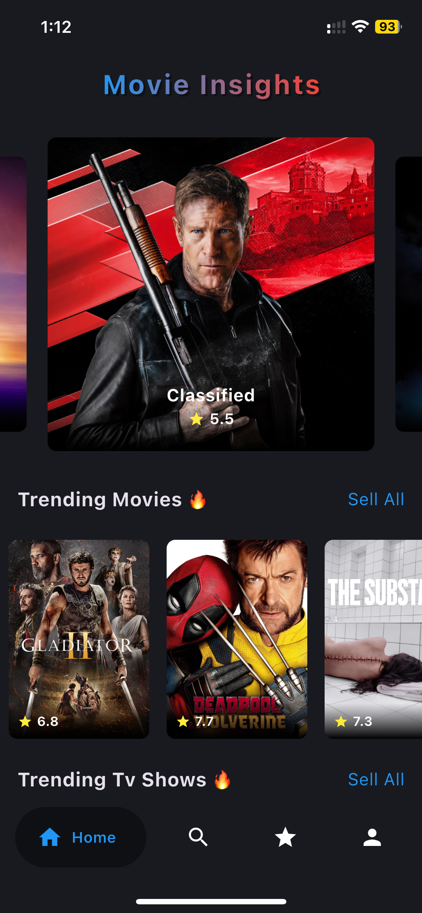
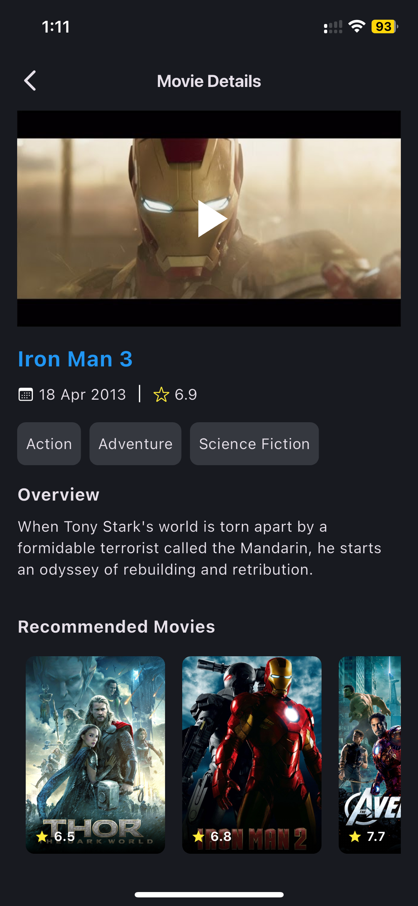
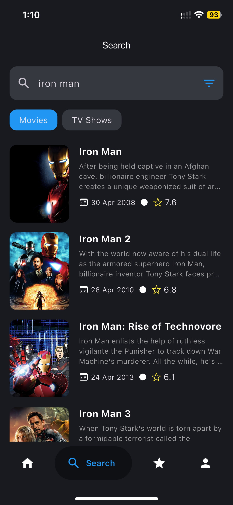
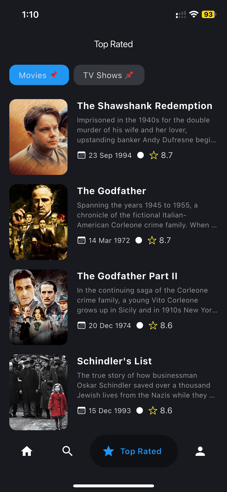
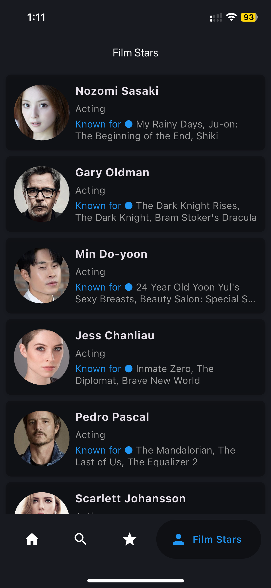
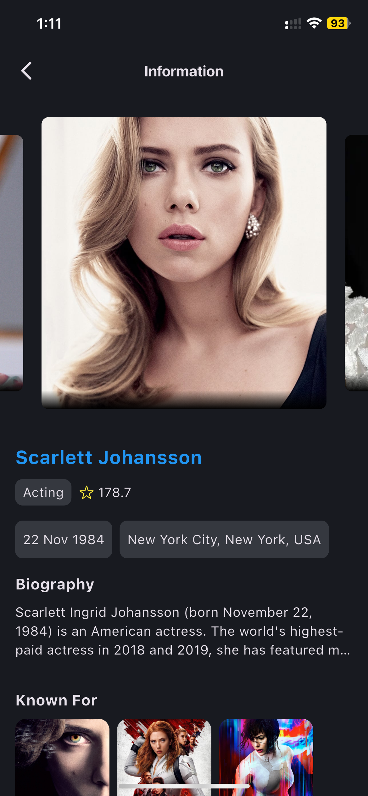

# Flutter Movie Information App

This project is a Flutter application that provides detailed information about movies and TV shows.
It follows the Clean Architecture principles to ensure a scalable, maintainable, and testable
codebase.

## Features

- Display detailed information about movies and TV shows
- Browse through seasons and episodes of TV shows
- View release dates, genres, and ratings
- Responsive UI for different screen sizes

## Clean Architecture

The project is structured following the Clean Architecture principles, which include:

- **Presentation Layer**: Contains the UI code and the state management logic using `flutter_bloc`.
- **Domain Layer**: Contains the business logic and entities.
- **Data Layer**: Handles data fetching from APIs and local storage.

## Technologies Used

- **Flutter**: For building the cross-platform mobile application.
- **Dart**: The programming language used for Flutter development.
- **flutter_bloc**: For state management.
- **get_it**: For dependency injection.
- **flutter_inappwebview**: For displaying web content within the app.
- **kotlin**: For Android-specific code.
- **gradle**: For building and managing Android dependencies.
- **pub**: For managing Dart dependencies.

## Getting Started

### Prerequisites

- Flutter SDK
- Dart SDK
- Android Studio or Visual Studio Code with Flutter and Dart plugins

### Installation

1. Clone the repository:
   ```sh
   git clone git@github.com:SiThuHeinn/flutter_movie_information_app.git
    ```
2. Navigate to the project directory:
3. Install the dependencies:
   ```sh
   flutter pub get
   ```
4. Run the app:
   ```sh
    flutter run
    ```

## Screenshots

<div style="display: flex; justify-content: space-around;">
   
   
   
   
   
   
</div>